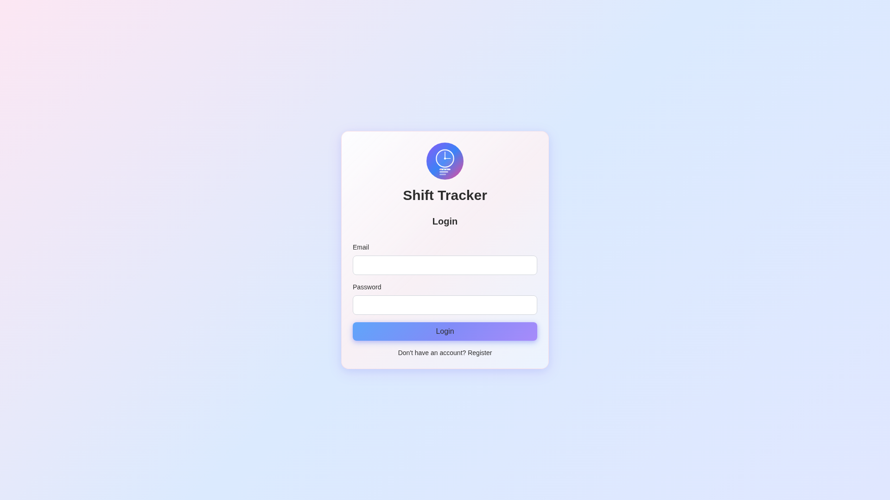
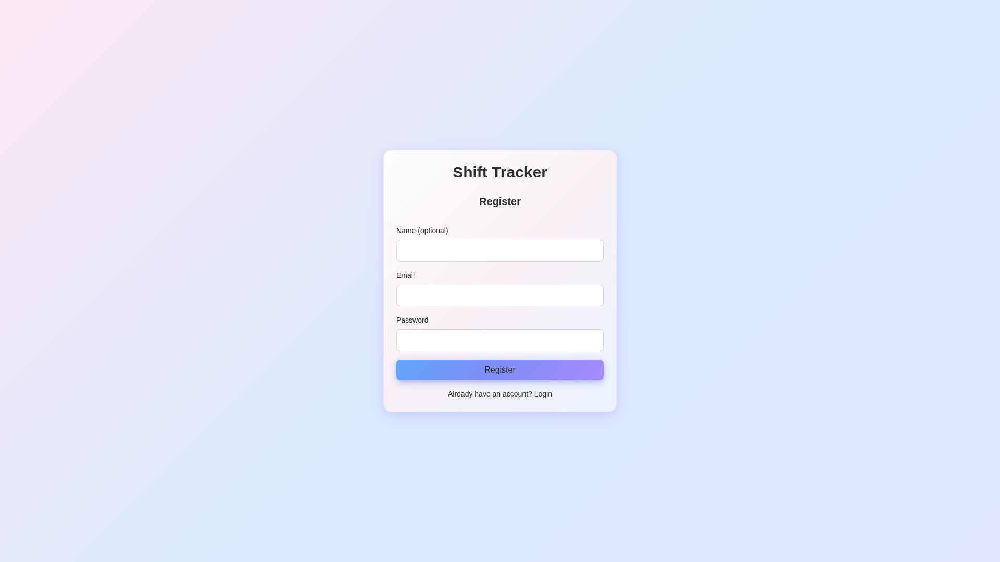
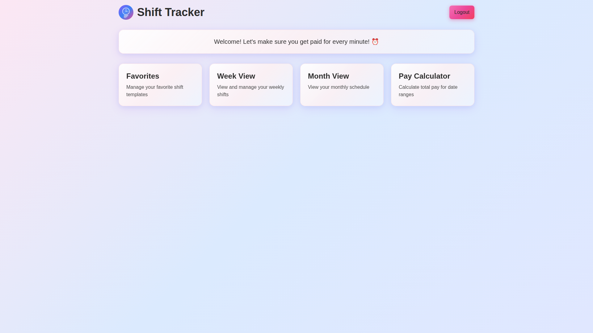
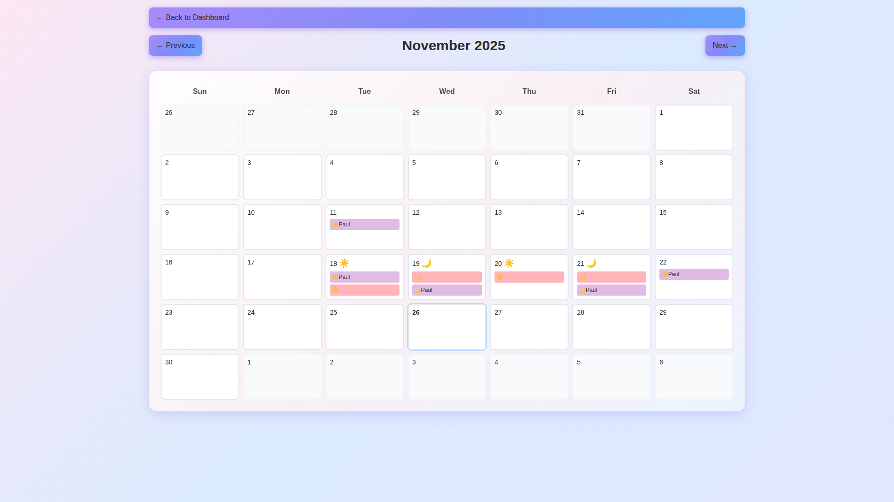
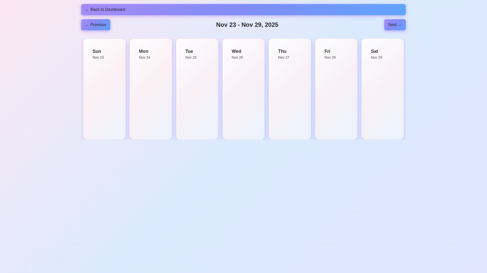
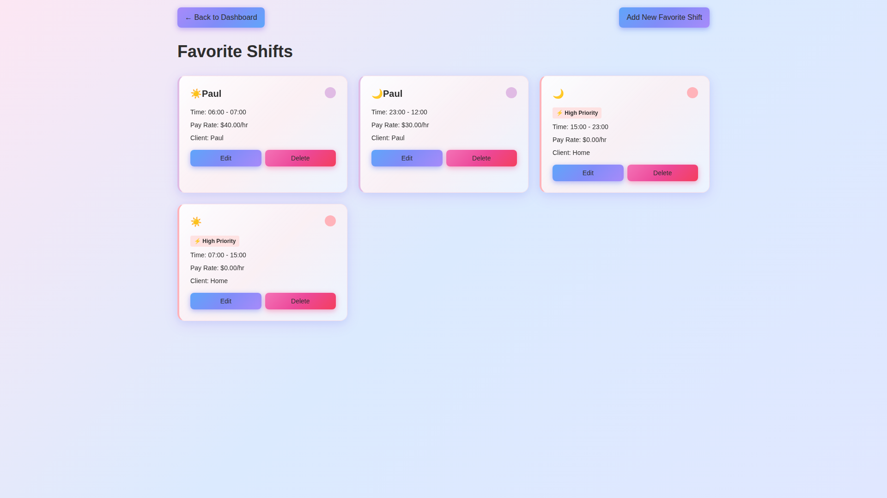

# Shift Tracker Application

A modern web application for tracking and managing work shifts with a beautiful bento-style UI.

**Live Demo**: [https://shiftapp.problex.com/](https://shiftapp.problex.com/)

## Screenshots

### Login Page


### Registration Page


### Dashboard


### Month View


### Week View


### Favorites Management


## Features

- **User Authentication**: Secure login and registration system
- **Favorite Shifts Management**: Create, edit, and delete shift templates
- **Week View**: View and manage shifts in a weekly calendar layout
- **Month View**: View shifts in a monthly calendar grid
- **Shift Management**: Add shifts from favorites, edit, and delete shifts
- **Bento-Style UI**: Modern, responsive design with smooth animations
- **Mobile-Friendly**: Fully responsive design for all device sizes

## Tech Stack

- **Next.js 14** - React framework with App Router
- **TypeScript** - Type-safe development
- **Tailwind CSS** - Utility-first CSS framework
- **MongoDB** - Database for storing users, shifts, and favorites
- **JWT** - Authentication tokens
- **bcryptjs** - Password hashing
- **date-fns** - Date manipulation utilities

## Getting Started

### Prerequisites

- Node.js 18+ and npm
- MongoDB database (local or cloud instance like MongoDB Atlas)

### Installation

1. Clone the repository:
```bash
cd ShiftApp
```

2. Install dependencies:
```bash
npm install
```

3. Set up environment variables:
Create a `.env.local` file in the root directory:
```env
MONGODB_URI=your_mongodb_connection_string
JWT_SECRET=your_jwt_secret_key
```

4. Run the development server:
```bash
npm run dev
```

5. Open [http://localhost:3000](http://localhost:3000) in your browser.

## Project Structure

```
ShiftApp/
├── app/
│   ├── api/              # API routes
│   │   ├── auth/         # Authentication endpoints
│   │   ├── favorites/    # Favorite shifts endpoints
│   │   └── shifts/       # Shifts endpoints
│   ├── dashboard/        # Dashboard page
│   ├── favorites/        # Favorites management page
│   ├── login/            # Login page
│   ├── register/         # Registration page
│   ├── week/             # Week view page
│   ├── month/            # Month view page
│   └── layout.tsx        # Root layout
├── components/           # Reusable components
├── lib/                  # Utility functions
│   ├── auth.ts          # Authentication utilities
│   ├── db.ts            # Database connection
│   └── models.ts        # TypeScript interfaces
└── package.json
```

## Database Schema

### Users Collection
- `_id`: ObjectId
- `email`: string (unique)
- `password`: string (hashed)
- `name`: string (optional)
- `createdAt`: Date

### FavoriteShifts Collection
- `_id`: ObjectId
- `userId`: string (reference to Users)
- `title`: string (required)
- `startTime`: string (HH:mm format)
- `endTime`: string (HH:mm format)
- `payRate`: number (required)
- `client`: string (optional)
- `color`: string (hex color code)
- `createdAt`: Date

### Shifts Collection
- `_id`: ObjectId
- `userId`: string (reference to Users)
- `favoriteShiftId`: string (optional, reference to FavoriteShifts)
- `date`: string (YYYY-MM-DD format)
- `title`: string (required)
- `startTime`: string (HH:mm format)
- `endTime`: string (HH:mm format)
- `payRate`: number (required)
- `client`: string (optional)
- `color`: string (hex color code)
- `createdAt`: Date

## Usage

1. **Register/Login**: Create an account or login to access the application
2. **Create Favorites**: Go to Favorites page and create shift templates
3. **Add Shifts**: Navigate to Week or Month view and click on a date to add shifts from favorites
4. **Edit/Delete**: Click on any shift to edit or delete it
5. **Navigate**: Use the navigation buttons to move between weeks/months

## Development

### Build for Production
```bash
npm run build
npm start
```

### Linting
```bash
npm run lint
```

## License

This project is open source and available under the MIT License.

